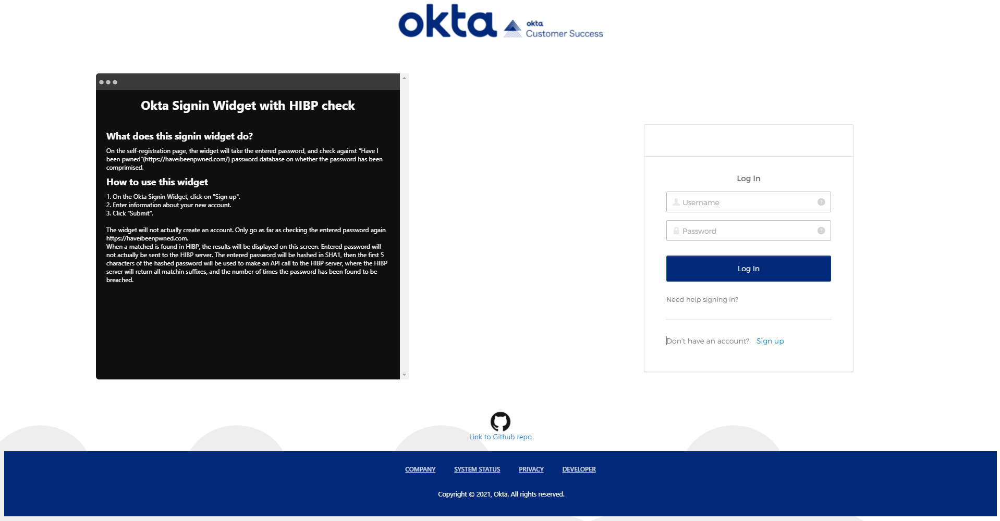
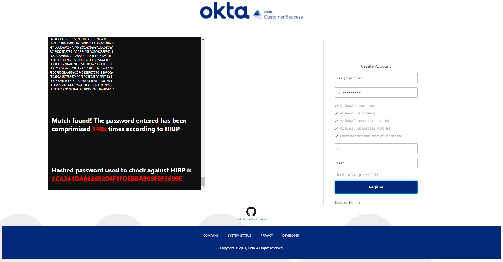

# Okta Signin Widget HIBP Checker

**Please note this is NOT an office Okta tool, and the Okta support does NOT provide support for this.**
This is merely a personal projct.

## What does this tool do?
In the widget's "registration" context, the password entered by the user to perform self-registration will be checked against [HIBP](https://haveibeenpwned.com/) prior to submitting the information to perform a self-registration.
In this demo, the widget will **NOT** actually register you.  The widget will only go as far as performing a check against [HIBP](https://haveibeenpwned.com/) and returing the number of times, the password has been found to be breached.  The results will be displayed on the terminal window.

The entered password will be checked against [HIBP](https://haveibeenpwned.com/) using the API that has been made available.  
More information on the [HIBP](https://haveibeenpwned.com/) API can be found here [https://haveibeenpwned.com/API/v2#PwnedPasswords](https://haveibeenpwned.com/API/v2#PwnedPasswords).

## Screenshots 



## Pre-requisites for running this application
- Nodejs setup with Angluar CLI
- Okta developer account - If you do not have one already, you can sign up for a free trial [here](https://developer.okta.com/signup/).
- Create an OIDC application in the Okta admin console to obtain the below information.
  - Client ID
  - redirect URL (you need to set this)
  - Authorisation server URL
  - Set CORS to allow redirect
 
## How to run this tool
- In a directory of your choice,

`git clone https://github.com/mortpanda/okta-siw-hibp-check.git`
- Enter the directory,

`cd okta-siw-hibp-check`
- Install pakackages

`npm install`
- Run the tool

`ng serve`
- Open the tool

`http://localhost:4200`

- Update the below file with the information from your org,

`src/app/okta-widget.js`

- Inside the JS file, the below section will need to be updated with your setting.

```
language: 'ja',
	i18n: { 
	//Overrides default text when using English. 
	//Override other languages by adding 
	//additional sections.
		'en': {
			'primaryauth.title': 'Log In',             
			'primaryauth.submit': 'Log In',            
		}
    },
    features: {
        registration: true,                           
		// Enable self-service registration flow
        rememberMe: false,                             
		// Setting to false will remove the checkbox to save username
    },
    baseUrl: "{{Base URL of the Okta org}}",
    redirectUri: "{{Redirect URL set in the Okta OIDC app}}",
    clientId: "{{Okta OIDC Application's client ID}}",   //CLIENT ID GOES HERE
    authParams: {
		issuer: '{{OIDC authorisation server URL}}',
        responseType: ['token', 'id_token'],
        responseMode: 'fragment',
        display: 'page',
        scope: ['openid','email','profile']
    },
```

