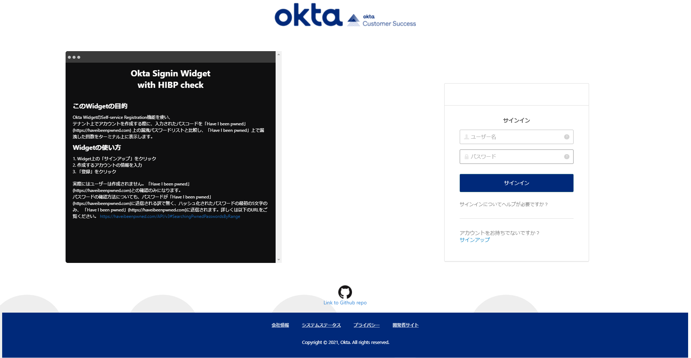

# Okta Signin Widget HIBP Checker

**Please note this is NOT an office Okta tool, and the Okta support does NOT provide support for this.**
This is merely a personal projct.

## What does this tool do?
In the widget's "registration" context, the password entered by the user to perform self-registration will have checked against [HIBP] (https://haveibeenpwned.com/) prior to submitting the information to perform a self-registration.
In this demo, the widget will **NOT** actual register you.  The widget will only go as far as performing a check against [HIBP] (https://haveibeenpwned.com/) and returing the number of times, the password has been found to be breached.  The results will be displayed on the terminal window.

## Screenshot (Japanese)

